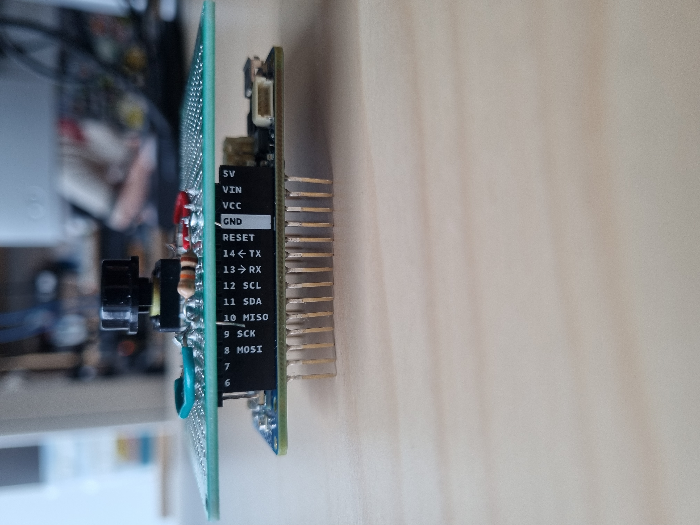
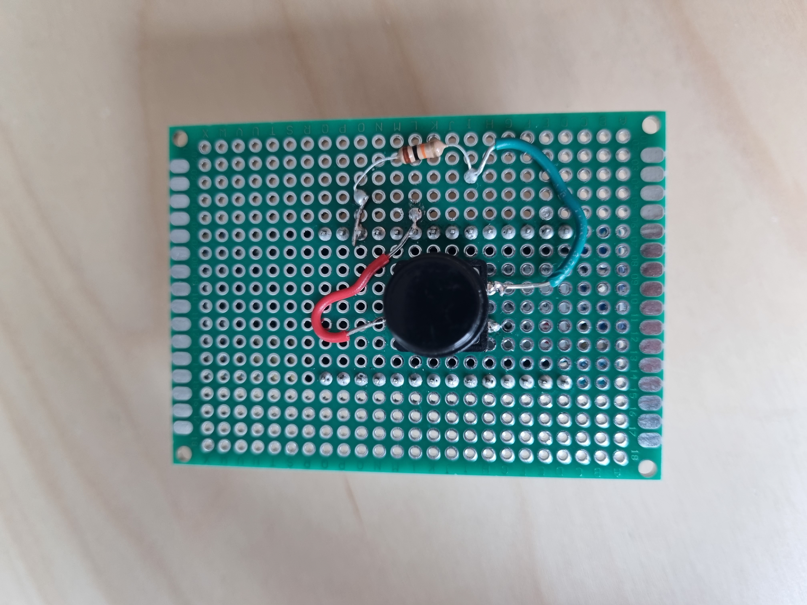
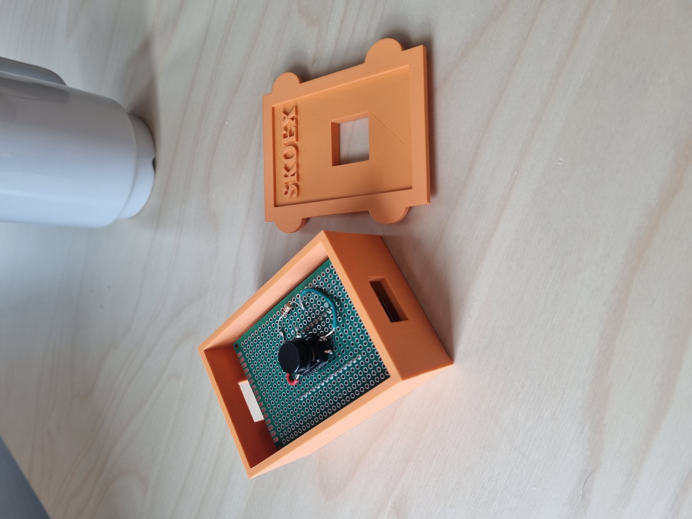
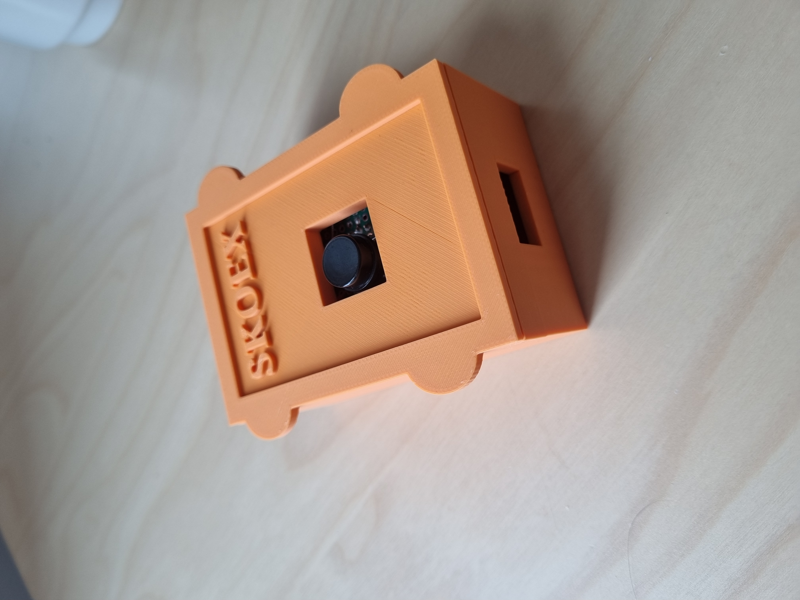

## Table of Contents

- [Skoex](#skoex)
- [NB-IoT](#nb-iot)
- [Components](#components)
- [Connections](#connections)
- [Software](#software)
  - [Web application for testing and visualisation](#web-application-for-testing-and-visualisation)
- [How to run](#how-to-run)
- [Result](#result)

## Skoex

Skoex is developing an innovative solution for schools to enhance student safety during emergencies. The system provides a connected door-stop mechanism that can be utilized in scenarios where students need to secure themselves quickly. The solution involves a pole that students place under the door handle to physically restrict entry. When the pole is removed from its designated wall mount, a signal is automatically transmitted to notify authorities or responders, ensuring a swift reaction to potential threats.

We are currently evaluating the most suitable wireless technology to ensure reliable signal transmission. The options under consideration include NB-IoT (Narrowband IoT) and LoRaWAN. NB-IoT offers the advantage of transmitting signals directly over the internet using CAT-M or NB-IoT protocols, which allows for straightforward integration with external systems via HTTP requests. On the other hand, LoRaWAN requires an intermediary layer to process and forward messages due to its network architecture.

Our goal is to select the technology that provides the most consistent and efficient communication path for ensuring the safety of students during emergencies. This decision will take into account factors such as network reliability, ease of integration, and coverage capability to meet the specific demands of the educational environment.

## NB-IoT

NB-IoT (Narrowband IoT) is a LPWAN (Low-Power Wide-Area Network) technology that connects devices to the cellular network. It is designed for low-power, low-data-rate applications, making it ideal for IoT devices that need long battery life and reliable coverage. 

Using NB-IoT would be a solid choice for Skoex. It makes the product easier to set up since there’s no need to rely on the location’s Wi-Fi, which could require maintenance or reconfiguration if the password changes. It also removes the need to install and manage a separate LoRaWAN gateway. Instead, the device just uses a SIM card to connect to the cellular network.

For this project we used the SARA-R410M-02B, a NB-IoT module that is built in on the Arduino MKRNB 1500.

## Components
* ~~Heltec ESP32 v2~~
* ~~KY-024 Hall effect sensor Alt. KY-021 Reed Switch~~
* ~~Magnets~~
* ~~SIM7080~~
* Arduino MKR MB-1500
* SARA-R410M-02B (Built-in module)
* Push-button


| Equipment | Reference | Function |
|----------|-----|------------|
| Arduino MKR MB-1500    | [Link](https://www.electrokit.com/arduino-mkr-nb-1500) | Handles input and connects to the cellular network via NB-IoT (SARA-R410M-02B) |
| Jumper wires      | [Link](https://www.electrokit.com/en/labbsladd-40-pin-30cm-hane/hane)  | Connects components  |
| Push-button  | [Link](https://www.electrokit.com/knappar-pcb-sortiment-12st?gad_source=1&gad_campaignid=17338847491&gbraid=0AAAAAD_OrGNW3UeaAQr22RGsr5Y2cJtkj&gclid=CjwKCAjwl_XBBhAUEiwAWK2hzi8p8xDo_8FqauPTIAoMdm8v9lpreQOyGnpULqWW1kATNay0vhl-sBoCeRAQAvD_BwE)  | Input |
| Resistor |[Link](https://www.electrokit.com/en/search.php?keyword=resistor&search=)| Pull-up resistor so the input is HIGH when button is not pressed |
| SIM card | ND | Connection to cellular |

### Connections:
1. ~~ESP32 to KY-024~~
    * ~~ESP32 Pin 25 to D0 KY-024~~
    * ~~ESP32 Pin 36 to A0 KY-024~~
    * ~~ESP32 V3.3 to VCC KY-024~~
    * ~~ESP32 GND to GND KY-024~~
2. ~~Alt. ESP32 to KY-021~~
    * ~~ESP32 Pin 25 to D0 KY-021~~
    * ~~ESP32 V3.3 to VCC KY-024~~
    * ~~ESP32 GND to GND KY-024~~
2. ~~ESP32 to SIM7080~~
    * ~~TX of ESP32 to RX of SIM7080~~
    * ~~RX of ESP32 to TX of SIM7080~~
    * ~~GND of ESP32 to GND of SIM7080~~

* MKRNB pin 13 to Button LS
* Button RS to 10k resistor
* 10k resistor to MKRNB GND






## Software 

We use the MKRNB library from the Arduino IDE to connect to the cellular network with the NB-IoT module. 


### Web application for testing and visualisation 

A simple webb application was made to provide an overview of how the final product could look. We used a MQTT test client found [here](https://testclient-cloud.mqtt.cool/), topic "test/mkrnb". A bridge was made to support both TCP and websockets simultaneously.

## How to run

1. Go to the [MQTT test client](https://testclient-cloud.mqtt.cool/) and select the TCP broker. Subscribe to the topic `test/mkrnb`.

2. (OPTIONAL) In a terminal:
   - Navigate to the project folder.
   - Start the bridge by running:

     ```bash
     node bridge.js
     ```

3. (OPTIONAL) Open `index.html` in a browser.

4. Insert a SIM-card into the micro-controller (located under the MKRNB)
5. Connect to a power-source (ex. Laptop)
6. Hold down the button/release button to communicate with the broker. 

## Result






